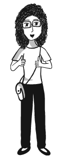
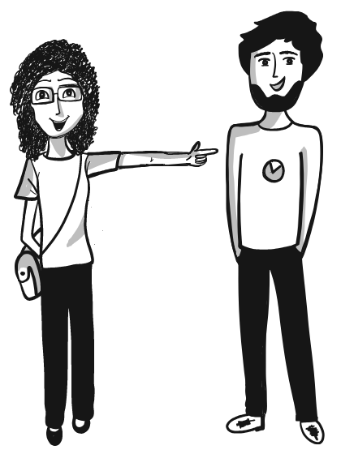
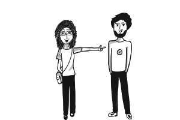
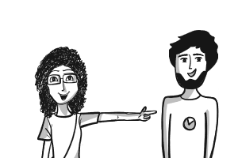
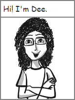
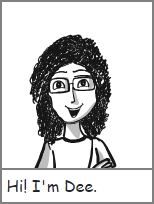
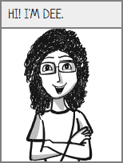
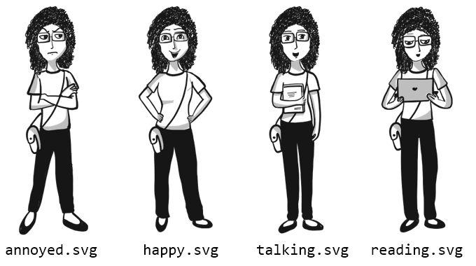

# comicgen

<!-- var introduction -->
We love comics. We badly wanted to create comic strips. But there was one
problem. Some of us can't draw a straight line for nuts.

But why should that stop us from creating comics? So here's a gift to ourselves
and the world &mdash; a **Comic Creator**.

We are sure you'd love the company of our friends [Dee](#?name=dee) &
[Dey](#?name=dey). Go on & have some fun.
<!-- end -->

<!-- var usage -->
## Installation

Load the comicgen library by adding this line in your HTML page's `<head>`:

```html
<link rel="stylesheet" href="https://cdn.jsdelivr.net/npm/comicgen/dist/comicgen.min.css">
<script async src="https://cdn.jsdelivr.net/npm/comicgen"></script>
```

You can also install comicgen locally using `npm` or `yarn`:

```bash
npm install comicgen
yarn install comicgen
```

... and then include:

```html
<link rel="stylesheet" href="node_modules/comicgen/dist/comicgen.min.css">
<script async src="node_modules/comicgen/dist/comicgen.min.js"></script>
```

## Usage

To embed a character, add:

```html
<g class="comicgen" name="dee" angle="straight" emotion="smile" pose="thumbsup"></g>
```

This inserts the following image in your HTML.
You can embed it anywhere, including inside an `<svg>` element.



The character is defined by 4 attributes:

- `name`: the name of the character (e.g. `dee`, `dey`)
- `angle`: which angle are they are facing (e.g. `straight`, `side`)
- `emotion`: what emotion their face expresses (e.g. `sad`, `happy`)
- `pose`: what pose their body shows (e.g. `pointingup`, `holdinglaptop`)

The list of valid combinations are available on the
[comicgen interactive gallery](https://gramener.com/comicgen/).

The characters are drawn on a 500 x 600 canvas. You can change this using:

- `width`: width of the image. Default: 500
- `height`: height of the image. Default: 600
- `x`: left position or x-offset. Default: 0
- `y`: top position or y-offset. Default: 1
- `mirror`: shsow mirror image. Value can be empty string or 1. Default: empty string
- `scale`: how much larger to make the image. Default: 1

Comicgen is tested on Chrome, Edge, and Firefox. It does not work on Internet Explorer.

## Composition

To combine multiple characters in a panel, embed them in an `<svg>` element.

You can change the `x`, `y`, `width`, `height`, `mirror` and `scale` to position each character.

```html
<svg width="500" height="600">
  <g class="comicgen" name="dee" angle="straight" emotion="smilehappy" pose="pointingright" x="-120"></g>
  <g class="comicgen" name="dey" angle="straight" emotion="smile" pose="handsinpocket" x="150"></g>
</svg>
```



You can resize the combined image by changing the `width` and `height` of the
SVG container.

```html
<svg width="300" height="200" viewBox="0 0 500 600">
  <g class="comicgen" name="dee" angle="straight" emotion="smilehappy" pose="pointingright" x="-120"></g>
  <g class="comicgen" name="dey" angle="straight" emotion="smile" pose="handsinpocket" x="150"></g>
</svg>
```

Set `viewBox` to the width and height of the comicgen elements. Then you can set
the outer `width` and `height` to anything.



This normally scales the image to fit both the width and height. To fit only one
side, use [preserveAspectRatio](https://developer.mozilla.org/en-US/docs/Web/SVG/Attribute/preserveAspectRatio).
For example, `preserveAspectRatio="xMidYMin slice"` in this case fits to width
and slices the height, preserving the top (YMin) of the image.

```html
<svg width="300" height="200" viewBox="0 0 500 600" preserveAspectRatio="xMidYMin slice">
  <g class="comicgen" name="dee" angle="straight" emotion="smilehappy" pose="pointingright" x="-120"></g>
  <g class="comicgen" name="dey" angle="straight" emotion="smile" pose="handsinpocket" x="150"></g>
</svg>
```



## Panels

[comicgen.css](https://cdn.jsdelivr.net/npm/comicgen/dist/comicgen.min.css)
provides 2 classes for layout:

- `comic-panel`
- `comic-row`

Use `class="comic-panel"` to can embed characters in a thick grey border. For example

```html
<div class="comic-panel">
  <g class="comicgen" name="dee" angle="straight" emotion="smilehappy" pose="handsfolded"
    x="-320" y="-120" scale="2.2" width="200" height="200"></g>
</div>
```


Panels are typically placed inside a `class="comic-row"`:

Here's an example with 2 panels. The second panel has 2 characters.

```html
<div class="comic-row">
  <div class="comic-panel" style="margin-right: 10px">
    <g class="comicgen" name="dee" angle="straight" emotion="smilehappy" pose="handsfolded"
      x="-320" y="-120" scale="2.2" width="200" height="200"></g>
  </div>
  <div class="comic-panel">
    <svg width="200" height="200">
      <g class="comicgen" name="dey" angle="straight" emotion="smile" pose="handsinpocket"
        x="-200" y="-120" scale="2.2" width="200" height="200"></g>
      <g class="comicgen" name="dee" angle="straight" emotion="smilehappy" pose="handsfolded"
        x="-250" y="-120" scale="1.4" width="200" height="200"></g>
    </svg>
  </div>
</div>
```


You can override the panel's background, border width and color using CSS
variables in your stylesheet.

```css
:root {
  --comic-background: #eee;     /* Light grey background. Default: transparent */
  --comic-border-color: #ccc;   /* Light grey border. Default: grey */
  --comic-border-width: 1px;    /* Thin border. Default 2px */
}
```


## Captions

[comicgen.css](https://cdn.jsdelivr.net/npm/comicgen/dist/comicgen.min.css)
provides `comic-caption-top` and `comic-caption-bottom` to add captions inside
a `.comic-panel`.

For example, this defines a caption on top:

```html
<div class="comic-panel">
  <div class="comic-caption-top">Hi! I'm Dee.</div>
  <g class="comicgen" name="dee" angle="straight" emotion="smilehappy" pose="handsfolded" x="-317" y="-119" scale="2.2" width="150" height="200"></g>
</div>
```



... or the bottom:

```html
<div class="comic-panel">
  <div class="comic-caption-bottom">Hi! I'm Dee.</div>
  <g class="comicgen" name="dee" angle="straight" emotion="smilehappy" pose="handsfolded" x="-317" y="-119" scale="2.2" width="150" height="200"></g>
</div>
```



You can override the caption's background, font and padding using CSS variables
in your stylesheet.

```css
:root {
  --comic-caption-background: #eee;         /* Light grey background. Default: white */
  --comic-caption-font: Neucha, cursive;    /* Custom Google font. Default: cursive */
  --comic-caption-padding: 0.25rem 0.5rem;  /* Custom margin. Default: 0.25rem */
}
.comic-caption-top, .comic-caption-bottom { /* Apply any custom styles you want */
  text-transform: uppercase;
}
```



## Fonts

[Google fonts has handwriting fonts](https://fonts.google.com/?category=Handwriting)
that can be used for the caption lettering.

Some fonts we like are:

| Font                            | Example text                                                         |
|---------------------------------|----------------------------------------------------------------------|
| [Architects Daughter][font-ad]  | [][font-ad] |
| [News Cycle][font-nc]           | [][font-nc]                   |
| [Indie Flower][font-if]         | [][font-if]               |
| [Amatic SC][font-ac]            | [][font-ac]                     |
| [Just Another Hand][font-jah]   | [][font-jah]    |
| [Patrick Hand][font-ph]         | [][font-ph]               |
| [Neucha][font-n]                | [][font-n]                            |
| [Handlee][font-h]               | [][font-h]                          |

[font-ad]: https://fonts.google.com/specimen/Architects+Daughter
[font-nc]: https://fonts.google.com/specimen/News+Cycle
[font-if]: https://fonts.google.com/specimen/Indie+Flower
[font-ac]: https://fonts.google.com/specimen/Amatic+SC
[font-jah]: https://fonts.google.com/specimen/Just+Another+Hand
[font-ph]: https://fonts.google.com/specimen/Patrick+Hand
[font-n]: https://fonts.google.com/specimen/Neucha
[font-h]: https://fonts.google.com/specimen/Handlee

## Strips

You can combine [captions](#captions) with [panels](#panels) to create a strip
like this:

```html
<div class="comic-row">
  <div class="comic-panel">
    <div class="comic-caption-top">Hi! I'm Dee.</div>
    <g class="comicgen" name="dee" angle="straight" emotion="smilehappy" pose="handsfolded" x="-317" y="-119" scale="2.2" width="150" height="200"></g>
  </div>
  <div class="comic-panel">
    <div class="comic-caption-top">I'm in a comic strip called Dee & Dey.</div>
    <g class="comicgen" name="dee" angle="straight" emotion="smilehappy" pose="handsfolded" x="-150" y="10" scale="1.5" width="150" height="200" mirror="1"></g>
  </div>
  <div class="comic-panel">
    <div class="comic-caption-top">And this is Dey, my co-star on this strip.</div>
    <svg width="300" height="200">
      <g class="comicgen" name="dee" angle="straight" emotion="smilehappy" pose="pointingright" x="160" y="0" scale="0.88" width="300" height="200" mirror="1"></g>
      <g class="comicgen" name="dey" angle="straight" emotion="smile" pose="handsinpocket" x="-120" y="10" scale="0.88" width="300" height="200"></g>
    </svg>
  </div>
</div>
```


<!-- end -->


## API

To explicitly run comicgen on a selector, run `comicgen(selector)`. This lets
you dynamically create or change a a character.

Here's an example in jQuery showing how you can create a character dynamically:

```js
// Add the character
$('<g class="new" name="dee" angle="straight" emotion="sad" pose="yuhoo"></g>').appendTo('body')
// Call comicgen()
comicgen('.new')
```


You can pass an `options` parameter to `comicgen()` to provide default values.
For example:

```js
$('<g class="new" name="dee" angle="straight"></g>').appendTo('body')
comicgen('.new', {
  name: 'dey',      // Set the default name. <g name="dee"> overrides this
  emotion: 'sad',   // Set the default emotion
  pose: 'yuhoo',    // Set the default pose, etc
  width: 400,
  height: 300
})
```


## Release

To publish a new version on npm:

```bash
# Update package.json version
# Run tests on dev branch
npm run lint
npm test
npm run test-chrome
npm run test-edge
npm run test-firefox

# Ensure that there are no build errors on the server
git commit . -m"DOC: Release version x.x.x"
git push

# Merge into dev branch
git checkout master
git merge dev
git tag -a v0.x.x -m"Add a one-line summary"
git push --follow-tags

# Publish to https://www.npmjs/package/comicgen maintained by @sanand0
npm publish

git checkout dev
```


<!-- var credits -->

## Credits

- Library developed by Kriti Rohilla <kriti.rohilla@gramenerit.com> and S Anand <s.anand@gramener.com>
- Conceived & designed by Ramya Mylavarapu <ramya.mylavarapu@gramener.com> & Richie Lionell <richie.lionell@gramener.com>

### Character credits

- Dee: By Ramya Mylavarapu <ramya.mylavarapu@gramener.com>
  under [CC0 license](https://creativecommons.org/choose/zero/)
- Dey: By Ramya Mylavarapu <ramya.mylavarapu@gramener.com>
  under [CC0 license](https://creativecommons.org/choose/zero/)
- [Humaaans](https://www.humaaans.com/): By [Pablo Stanley](https://twitter.com/pablostanley)
  under [CC-BY license](https://creativecommons.org/licenses/by/4.0/)

<!-- end -->

<!-- var contributing -->
## Contributing

We'd love your help in improving Comicgen.

If you're a developer, you could help
[fix bugs](https://github.com/gramener/comicgen/labels/bug) or
[add features](https://github.com/gramener/comicgen/labels/enhancements).
Some issues are marked
[help wanted](https://github.com/gramener/comicgen/labels/help%20wanted).
These are a good starting point.

If you're a designer, you could help add new characters.

### Add new characters

Characters are made of 1 or more SVG images.

The easiest way to create a character is to draw a dozen SVGs and save them as
individual files **of the same dimensions**. For example:



A better way would be to break up the character into different parts. For
example, you could draw faces with different emotions and save them under an
`faces/` folder:


Then you could draw the bodies under a `bodies/` folder:


If you do this, you must make sure that:

- All faces have the **same dimensions**, and are at the **same position** within the SVG
- All bodies have the **same dimensions**, and are at the **same position** within the SVG
- When you super-impose any face on any body, the **images should align**.

You can choose to break up the images in any number of ways. For example:

- `faces/`, `bodies/`
- `face/`, `trunk/`, `leg`, `shoes`
- `hair`, `face`, `eyes`, `mouth`, `trunk/`, `legs/`

The more combinations you have, the more complex your image becomes. You could
start small and then add variety.

### Submit new characters

Give your character a name (e.g. "Ant Man"). Save the SVG files under a folder
with the character name (e.g. "ant-man" - lower-case, use hyphens as separator).
Add this folder under the
[files/](https://github.com/gramener/comicgen/tree/master/files/) folder.

Then [send a pull request](https://help.github.com/en/articles/creating-a-pull-request)
or email S Anand <s.anand@gramener.com>.

When doing this, please mention one of the following:

- "I release these images under the [CC0](https://creativecommons.org/choose/zero/) license", OR
- "I release these images under the [CC-BY](https://creativecommons.org/licenses/by/4.0/) license"


<!-- end -->

<!-- var social -->
## Share

<p class="d-flex">
  <a href="https://twitter.com/intent/tweet?text=Make%20your%20own%20%23comics%20with%20the%20JS%20API%20by%20%40Gramener%20https%3A%2F%2Fgramener.com%2Fcomicgen%2F" class="btn btn-link py-0 pl-0 pr-1" target="_blank" rel="noopener" title="Share on Twitter">
    <i class="fab fa-twitter-square fa-2x"></i>
  </a>
  <a href="https://www.facebook.com/dialog/share?app_id=163328100435225&display=page&href=https%3A%2F%2Fgramener.com%2Fcomicgen%2F&redirect_uri=https%3A%2F%2Fgramener.com%2Fcomicgen%2F&quote=Make%20your%20own%20%23comics%20with%20the%20JS%20API%20by%20%40Gramener%20https%3A%2F%2Fgramener.com%2Fcomicgen%2F" class="btn btn-link py-0 pl-0 pr-1" target="_blank" rel="noopener" title="Share on Facebook">
    <i class="fab fa-facebook-square fa-2x"></i>
  </a>
  <a href="https://www.linkedin.com/sharing/share-offsite/?url=https://gramener.com/comicgen/" class="btn btn-link py-0 pl-0 pr-1" target="_blank" rel="noopener" title="Share on LinkedIn">
    <i class="fab fa-linkedin fa-2x"></i>
  </a>
  <a href="https://github.com/gramener/comicgen" class="btn btn-link py-0 pl-0 pr-1" target="blank" rel="noopener" title="Fork on Github">
    <i class="fab fa-github fa-2x"></i>
  </a>
</p>
<!-- end -->

<!-- var social_markdown -->
<!-- Github README won't display the above share icons. So create links. Don't display this on index.html -->
<ul>
  <li><a href="https://twitter.com/intent/tweet?text=Make%20your%20own%20%23comics%20with%20the%20JS%20API%20by%20%40Gramener%20https%3A%2F%2Fgramener.com%2Fcomicgen%2F">Share on Twitter</a></li>
  <li><a href="https://www.facebook.com/dialog/share?app_id=163328100435225&display=page&href=https%3A%2F%2Fgramener.com%2Fcomicgen%2F&redirect_uri=https%3A%2F%2Fgramener.com%2Fcomicgen%2F&quote=Make%20your%20own%20%23comics%20with%20the%20JS%20API%20by%20%40Gramener%20https%3A%2F%2Fgramener.com%2Fcomicgen%2F">Share on Facebook</a>
  <li><a href="https://www.linkedin.com/sharing/share-offsite/?url=https://gramener.com/comicgen/">Share on LinkedIn</a>
  <li><a href="https://github.com/gramener/comicgen">Fork on Github</a></li>
</ul>
<!-- end -->
